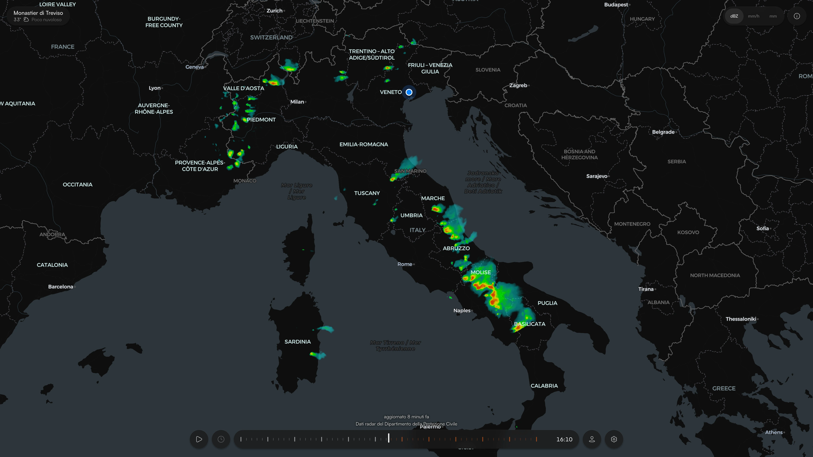
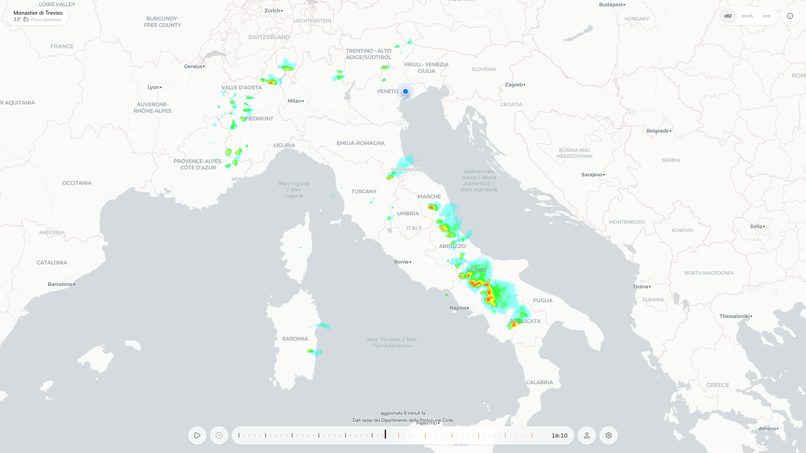
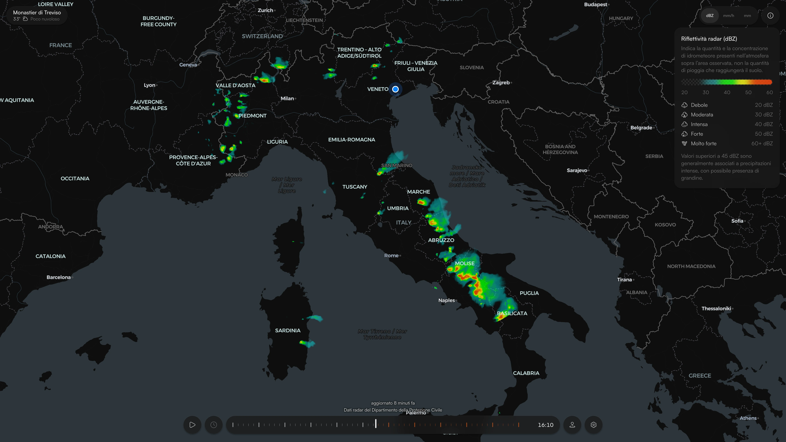
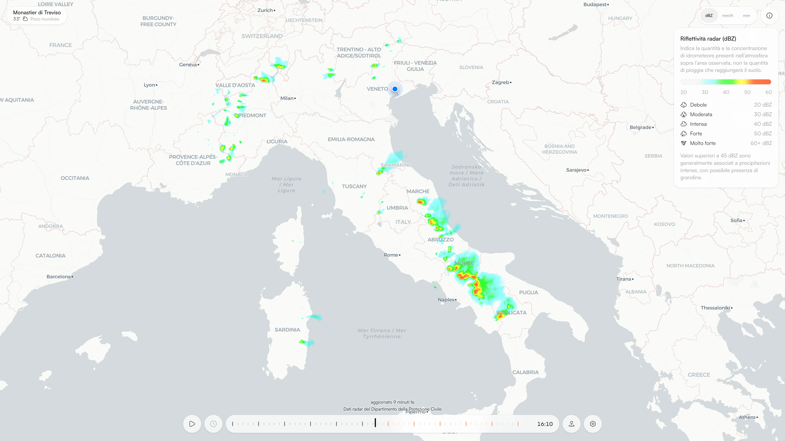
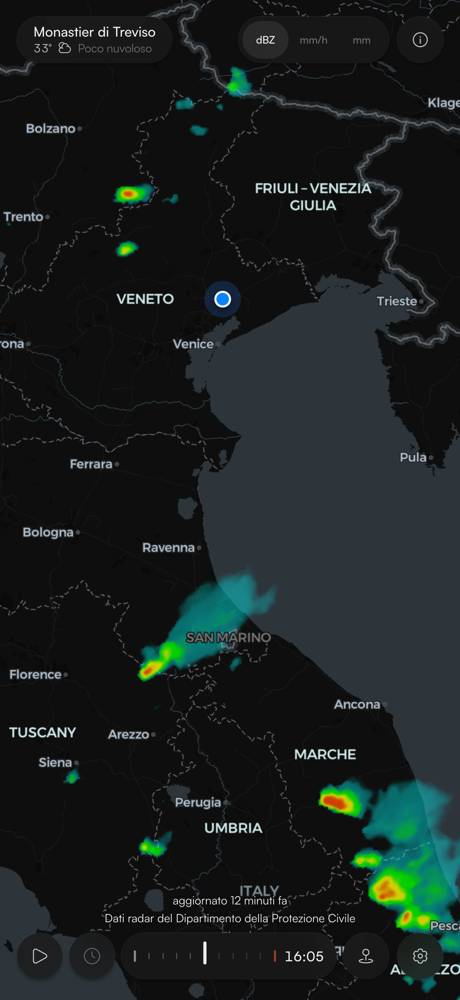
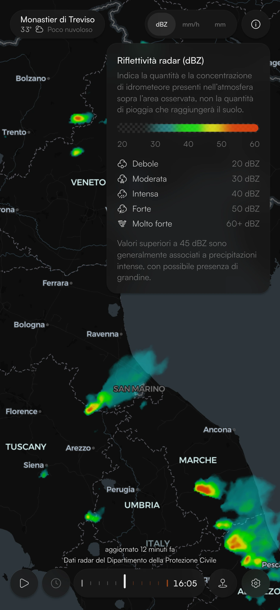
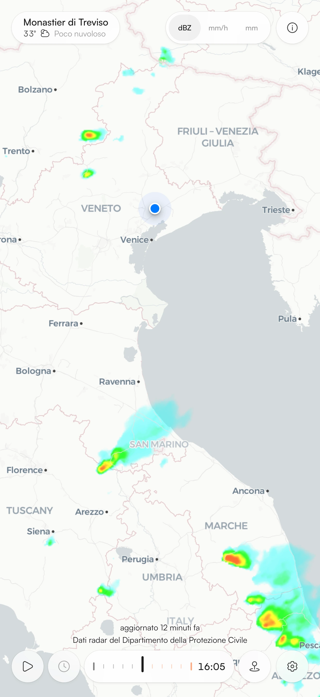
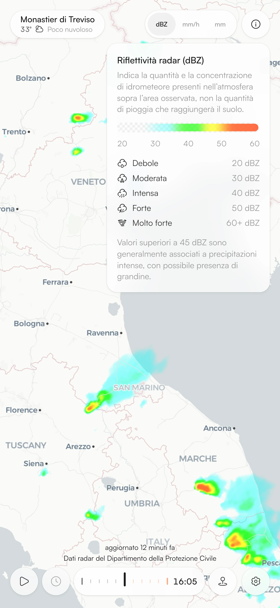

<p align="center">
  
</p>

<h1 align="center">Nembo</h1>

<p align="center">
  <strong>Sleek, minimal and curated Italian weather radar with 30-minute<br>
  nowcasting, built from data provided by the Italian Civil Protection Department.</strong>
</p>

<p align="center">
  <a href="https://www.typescriptlang.org/"></a>
  <a href="https://react.dev/"></a>
  <a href="https://nextjs.org/"></a>
  <a href="https://maplibre.org/"></a>
  <a href="https://radar.protezionecivile.it/"></a>
  <a href="LICENSE"></a>
</p>


Nembo was built with a simple goal: to make the evolution of precipitation over Italy immediately legible, showing not only what the radar is observing right now, but also how that precipitation is moving and where it might be in the next thirty minutes.

The **Italian Civil Protection Department (DPC)** updates its radar observations every five minutes. Nembo uses those observations to build a continuous one-hour timeline at one frame per minute: thirty minutes of history, the present, and thirty minutes of forecast.

The intermediate frames are not graphical interpolations. Observed precipitation is carried forward in time along the motion actually measured by the radar. The forecast is therefore **nowcasting based on advection of the radar echo**, rather than a simple animation of the data.

Nembo is a static application with no backend of its own: motion estimation and forecast generation both happen directly in the browser.

---

## Features

Nembo lets you explore precipitation through three different physical quantities:

- **Reflectivity**, in dBZ.
- **Rain rate**, in mm/h.
- **Rainfall accumulated over the last hour**, in mm.

The display adapts to the selected quantity, with a contextual legend and a dedicated colour scale.

The **one-hour timeline** allows you to move freely between past observations, the present and the forecast. Playback can run on a loop or be controlled quickly from the keyboard, using the space bar for play and pause.

The forecast extends **30 minutes into the future** and is computed from the observed motion of the precipitation. When that motion cannot be estimated reliably, Nembo falls back on the steering wind.

**Geolocation** can also be used to centre the map on your position and show the place name and current weather conditions.

The interface supports **light, dark and system themes**, along with the option to turn off sound and haptic feedback.

---

## Screenshots

### Desktop

<table>
  <tr>
    <td align="center" width="50%">
      
      <br><sub>Dark</sub>
    </td>
    <td align="center" width="50%">
      
      <br><sub>Light</sub>
    </td>
  </tr>
  <tr>
    <td align="center" width="50%">
      
      <br><sub>Legend</sub>
    </td>
    <td align="center" width="50%">
      
      <br><sub>Legend</sub>
    </td>
  </tr>
</table>

### Mobile

<table>
  <tr>
    <td align="center" width="25%">
      
      <br><sub>Dark</sub>
    </td>
    <td align="center" width="25%">
      
      <br><sub>Legend</sub>
    </td>
    <td align="center" width="25%">
      
      <br><sub>Light</sub>
    </td>
    <td align="center" width="25%">
      
      <br><sub>Legend</sub>
    </td>
  </tr>
</table>

---

## How it works

### The radar data

The DPC publishes radar observations as WebP tiles on a Web Mercator grid. Nembo uses a **1280 × 1792 pixel** mosaic over Italy, at a resolution of roughly **900 metres per pixel**.

The images contain no pre-rendered colour view: every pixel holds the radar value itself. The **red channel** encodes the physical value linearly (for reflectivity, from `0 → 0 dBZ` to `255 → 60 dBZ`) while the **alpha channel** separates valid data from areas with no observation. The green and blue channels are ignored, since the chroma subsampling introduced by WebP makes their content unrepresentative of the signal.

Working on the raw data offers two fundamental advantages. First, Nembo can build its own **colour palette** dynamically from the theme's CSS tokens, without losing precision to quantisation into colour bands. Second, motion is estimated directly on **reflectivity values**, so the computation never has to chase a palette: different values flattened to the same colour stay distinguishable, and threshold crossings introduce no false motion.

### The forecast

Nembo estimates how precipitation moves by comparing radar observations taken thirty minutes apart.

The observations are first simplified to preserve the strongest precipitation cores. Nembo then tracks their movement to determine the dominant direction and speed of the precipitation.

To capture local variations, this motion is refined with optical flow. This allows different areas of precipitation to move independently while keeping the overall field coherent where the data is less reliable.

The resulting motion field is used to move precipitation forward in five-minute steps. Rather than simply shifting the entire image, Nembo follows the estimated trajectories, allowing precipitation to rotate, stretch and compress as it moves.

When the radar observations are not sufficient to determine a reliable motion, Nembo falls back to the **steering wind**, calculated from the atmosphere between 850 and 500 hPa. If that is unavailable too, no forecast is generated rather than simply extending the current conditions into the future.

The entire process takes around **120 ms** and runs in a **Web Worker**, keeping the interface responsive while the forecast is calculated.

---

## What it can and cannot forecast

Nembo is a nowcasting system **based on the motion of observed precipitation**. This carries one fundamental consequence: the application can carry into the future what the radar is already observing, but it cannot forecast phenomena that are not yet present in the data.

A storm cell that will form twenty minutes from now, for example, is not present in the current observation and therefore cannot be generated by the forecast.

In the same way, Nembo is not a numerical weather model: it does not simulate the atmosphere and does not directly account for instability, orography or the other physical processes responsible for the formation and evolution of precipitation.

The goal is a narrower one: **to estimate where what the radar is already observing will move within the immediate horizon of the next 30 minutes**.

---

## Project structure

The project is organised by separating data acquisition and processing from the components responsible for the interface.

```text
src/lib/
  grid.ts            zoom-7 domain, pixel/degree conversion, coarse grid
  dpc.ts             service contract: tile URLs, product scales, coverage
  tiles.ts           tile fetch and WebP decode to value plus no-data mask
  nowcast.ts         observation cache, sequence assembly, worker clients
  flow.ts            block-matched consensus vector, pyramidal Lucas-Kanade
  motion.worker.ts   estimateFromCoarse off the main thread; message plumbing
  field.ts           signal boxes, trajectory integration, warp, blend, paint
  render.worker.ts   compose and renderField off the main thread
  colormap.ts        256-entry RGBA lookup table built from the theme tokens
  wind.ts            mass-weighted 850-500 hPa steering flow from Open-Meteo
  place.ts           reverse geocoding and current conditions for a fix
  visibility.ts      intervals and polls gated on document visibility
  basemap.ts         CARTO vector style, with a bundled coastline fallback
  trace.ts           bounded diagnostic log, persisted to localStorage
  theme.ts           light/dark/system preference and its persistence
  sound.ts           declarative synthesis of the interface's sound set
  haptics.ts         vibration triggers and the shared feedback preference

src/components/
  RadarMap.tsx       map lifecycle, radar layer, and the application state
  Timeline.tsx       frame axis, tick ruler, playback, pointer-driven scrub
  Dock.tsx           product tabs and the legend toggle
  Settings.tsx       sound, haptics and theme controls, plus attribution
  Legend.tsx         per-product colour scale and its band thresholds
  PlacePill.tsx      place name and conditions for the current fix
  SlidingTabs.tsx    tab control with an animated selection pill
  TracePanel.tsx     overlay rendering of the persisted trace
```

---

## Data sources

| Source | Used for |
|---|---|
| [Italian Civil Protection Department](https://radar.protezionecivile.it/) | Radar data, with attribution shown inside the application |
| [Open-Meteo](https://open-meteo.com) | Steering wind and current weather conditions |
| [BigDataCloud](https://www.bigdatacloud.com) | Reverse geocoding |
| [CARTO](https://carto.com) | Base map, Positron / Dark Matter, based on OpenStreetMap |

---

## Note

Nembo is a **personal project currently in development**.

The application uses radar data from the Italian Civil Protection Department, but is **not affiliated with, endorsed by, or developed by the Civil Protection Department**.
